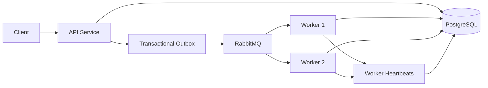

# TaskForge

TaskForge is a distributed asynchronous background job processing system built with Java and Spring Boot.

It provides reliable job submission and execution using PostgreSQL and RabbitMQ, with support for retries, dead-letter handling, transactional outbox messaging, multiple workers, worker crash recovery, idempotent job claiming, and cooperative job cancellation.

## Features

- Asynchronous job execution with RabbitMQ
- Persistent job state stored in PostgreSQL
- Multiple worker instances with unique worker identities
- Worker registration and heartbeat tracking
- Automatic recovery of jobs owned by crashed workers
- Retry handling with delayed retry queues
- Dead-letter handling after retry exhaustion
- Transactional Outbox pattern for reliable message delivery
- Duplicate message protection and idempotent job claiming
- Pessimistic locking for concurrent state transitions
- Cancellation of queued, retrying, and running jobs
- Worker-specific cancellation queues
- Cooperative cancellation support for long-running handlers
- Flyway database migrations
- Modular Maven architecture

## Architecture



TaskForge separates job submission from job execution.

The API persists the job and its corresponding outbox message in the same database transaction. The outbox publisher then delivers the message to RabbitMQ. Worker instances consume jobs independently and use database locking to ensure that only one worker can claim a job.

## Modules

```text
taskforge
├── api-service
├── worker-service
├── taskforge-domain
└── taskforge-contracts
```

### `api-service`

Responsible for:

- Job submission
- Job retrieval
- Job cancellation
- Transactional outbox persistence
- Outbox publishing
- Database migrations

### `worker-service`

Responsible for:

- Consuming job messages
- Executing job handlers
- Retry processing
- Worker registration
- Worker heartbeats
- Worker crash recovery
- Cancellation handling

### `taskforge-domain`

Contains shared domain models and job lifecycle rules.

Examples:

- `Job`
- `JobStatus`
- Job state transitions

### `taskforge-contracts`

Contains messaging contracts shared between services, including RabbitMQ routing keys and queue definitions.

## Job Lifecycle

A typical job follows this lifecycle:

```text
QUEUED
   |
   v
RUNNING
   |
   +----------> COMPLETED
   |
   +----------> RETRYING
   |               |
   |               v
   |             RUNNING
   |
   +----------> DEAD_LETTER
```

Cancellation adds the following transitions:

```text
QUEUED ---------> CANCELLED

RETRYING -------> CANCELLED

RUNNING --------> CANCEL_REQUESTED
                       |
                       v
                   CANCELLED
```

Domain methods control valid transitions instead of allowing arbitrary status updates.

## Reliable Message Delivery

TaskForge uses the **Transactional Outbox Pattern** to prevent inconsistencies between PostgreSQL and RabbitMQ.

Instead of:

```text
Save job
Publish RabbitMQ message
```

the API performs:

```text
Database Transaction
├── Save Job
└── Save Outbox Message
```

After the transaction commits, an outbox publisher asynchronously sends pending messages to RabbitMQ.

If RabbitMQ is temporarily unavailable, the outbox message remains persisted and publishing is retried later.

The same mechanism is also used for cancellation commands sent to running workers.

## Retry Handling

When a handler fails with a retryable error:

```text
RUNNING
   |
   v
RETRYING
   |
   v
RabbitMQ retry queue
   |
   v
RUNNING
```

Retry queues use RabbitMQ TTL and dead-letter routing to delay execution before returning the job to the main execution queue.

If the configured retry limit is exhausted, the job transitions to:

```text
DEAD_LETTER
```

## Idempotency and Concurrency

RabbitMQ can deliver messages more than once, so job execution cannot assume exactly-once delivery.

TaskForge protects job execution using:

- Pessimistic database locking
- Atomic job claiming
- State validation
- Duplicate message detection

A worker may only claim jobs in executable states such as:

```text
QUEUED
RETRYING
```

If another worker has already claimed or completed the job, the duplicate message is ignored.

## Multiple Workers

Multiple worker instances can consume from the same execution queue.

Each worker has its own identity:

```bash
WORKER_ID=worker-1
WORKER_ID=worker-2
```

For example:

```bash
WORKER_ID=worker-1 mvn -pl worker-service spring-boot:run
```

and:

```bash
WORKER_ID=worker-2 mvn -pl worker-service spring-boot:run
```

The worker ID is stored on a job while it is running:

```text
RUNNING | worker-1
```

When execution finishes, ownership is cleared.

## Worker Heartbeats and Crash Recovery

Workers register themselves in the database and periodically update their heartbeat.

```text
workers
├── id
├── status
├── started_at
└── last_heartbeat_at
```

If a worker stops sending heartbeats, another worker can detect it as stale.

For example:

```text
Job A -> RUNNING -> worker-1

worker-1 crashes
        |
        v
worker-1 -> OFFLINE
        |
        v
Job A -> RETRYING
        |
        v
worker-2 claims Job A
```

This prevents jobs from remaining permanently stuck in `RUNNING`.

If a job was already in `CANCEL_REQUESTED` when its worker crashed, recovery finalizes it as `CANCELLED` instead of retrying it.

## Job Cancellation

Queued and retrying jobs can be cancelled immediately.

Running jobs use cooperative cancellation.

```text
PATCH /api/jobs/{id}/cancel
        |
        v
CANCEL_REQUESTED
        |
        v
Transactional Outbox
        |
        v
RabbitMQ
        |
        v
Worker-specific cancellation queue
        |
        v
Cancellation Registry
        |
        v
JobExecutionContext
        |
        v
CANCELLED
```

Each worker owns a dedicated cancellation queue.

Example routing keys:

```text
worker.worker-1.cancel
worker.worker-2.cancel
```

This ensures that a cancellation command is delivered to the worker currently executing the job.

Long-running handlers can support cancellation checkpoints through `JobExecutionContext`:

```java
public void execute(JobExecutionContext context) {

    for (...) {
        context.checkCancellation();

        // process part of the job
    }
}
```

Handlers do not need to know how RabbitMQ or the internal cancellation registry works.

## Example Job Types

TaskForge currently includes example handlers such as:

- `PDF_REPORT`
- `CSV_IMPORT`
- Simulated background jobs

The handler abstraction allows additional job types to be added without changing the messaging infrastructure.

## Technology Stack

- Java 21
- Spring Boot
- Spring Data JPA
- Spring AMQP
- PostgreSQL
- RabbitMQ
- Hibernate
- Flyway
- Maven
- Docker

## Getting Started

### Prerequisites

Make sure the following are installed:

- Java 21+
- Maven
- Docker
- PostgreSQL or Docker

### 1. Start PostgreSQL

Example using Docker:

```bash
docker run -d \
  --name taskforge-postgres \
  -p 5432:5432 \
  -e POSTGRES_DB=taskforge \
  -e POSTGRES_USER=taskforge \
  -e POSTGRES_PASSWORD=taskforge \
  postgres:18
```

### 2. Start RabbitMQ

```bash
docker run -d \
  --name taskforge-rabbitmq \
  -p 5672:5672 \
  -p 15672:15672 \
  -e RABBITMQ_DEFAULT_USER=taskforge \
  -e RABBITMQ_DEFAULT_PASS=taskforge \
  rabbitmq:4.3-management-alpine
```

RabbitMQ Management UI:

```text
http://localhost:15672
```

Credentials:

```text
username: taskforge
password: taskforge
```

### 3. Build the Project

From the project root:

```bash
mvn clean install -DskipTests
```

### 4. Start the API

```bash
mvn -pl api-service spring-boot:run
```

The API runs on:

```text
http://localhost:8080
```

### 5. Start a Worker

```bash
WORKER_ID=worker-1 mvn -pl worker-service spring-boot:run
```

Start another worker if desired:

```bash
WORKER_ID=worker-2 mvn -pl worker-service spring-boot:run
```

## API Examples

### Submit a Job

```bash
curl -X POST http://localhost:8080/api/jobs \
  -H "Content-Type: application/json" \
  -d '{
    "type": "PDF_REPORT",
    "priority": "NORMAL",
    "payload": {
      "report": "example"
    },
    "maxRetries": 3
  }'
```

Example response:

```json
{
  "id": "f6c3a807-133d-4095-8542-f2ee531ad0a0",
  "type": "PDF_REPORT",
  "status": "QUEUED",
  "priority": "NORMAL",
  "retryCount": 0,
  "maxRetries": 3
}
```

### Cancel a Job

```bash
curl -X PATCH \
  http://localhost:8080/api/jobs/{jobId}/cancel
```

A queued job transitions directly to:

```text
CANCELLED
```

A running job transitions through:

```text
RUNNING
→ CANCEL_REQUESTED
→ CANCELLED
```

## Design Goals

TaskForge is built to explore practical backend and distributed-system problems rather than acting as a simple CRUD application.

The project focuses on:

- Reliable asynchronous processing
- Failure recovery
- Concurrency control
- Message delivery guarantees
- Explicit state transitions
- Horizontal worker execution
- Separation of infrastructure and domain logic

## Roadmap

Planned improvements include:

- Automated integration testing with Testcontainers
- Metrics and observability
- Scheduled jobs
- Priority-based execution
- Administrative monitoring endpoints
- Improved operational dashboards

## Author

**Mert Dikdaş**